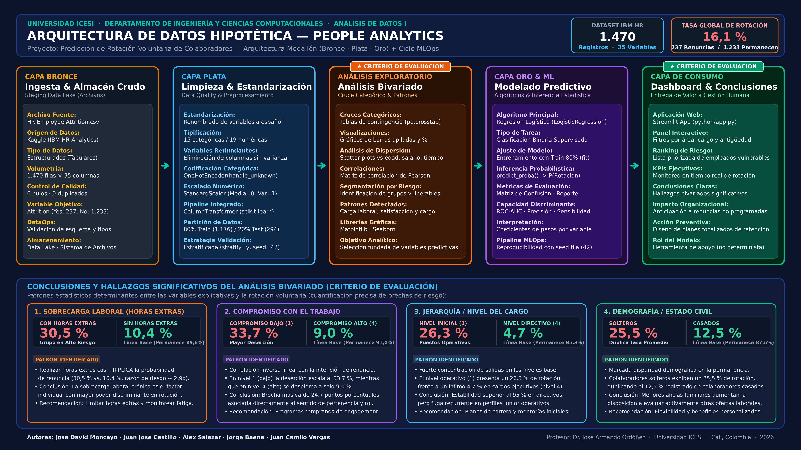

# 📊 Predicción de Rotación Voluntaria (People Analytics)

Proyecto de Ciencia de Datos enfocado en el análisis exploratorio y modelado predictivo de la rotación voluntaria de colaboradores (*Employee Attrition*). Incluye un cuaderno interactivo en Jupyter Notebook y una aplicación web interactiva desarrollada con Streamlit.

---

## 🎯 Contexto y Definición del Problema

La salida inesperada de colaboradores genera pérdida de conocimiento crítico, sobrecarga de trabajo en los equipos y riesgos en la continuidad de procesos estratégicos.

### Pregunta de Análisis SMART
> **"¿Podemos identificar, a partir de las características laborales y personales de los empleados, cuáles presentan una mayor probabilidad de rotación voluntaria, con el fin de apoyar las decisiones de Gestión Humana?"**

- **Específica (S):** Identificar colaboradores en riesgo de renuncia voluntaria.
- **Medible (M):** Estimación de la probabilidad de rotación individual (0% a 100%).
- **Alcanzable (A):** Uso de variables demográficas, laborales y de satisfacción disponibles.
- **Relevante (R):** Facilita la creación de planes de retención y optimización de People Analytics.
- **Temporal (T):** Prototipo predictivo para anticipar salidas no programadas.

---

## 📁 Estructura del Repositorio

El proyecto está organizado de la siguiente manera:

```text
Prediccion-Rotacion-Voluntaria/
├── arquitectura/
│   └── arquitectura_datos_hipotetica.png         # Diagrama de arquitectura de datos (Medallón + MLOps)
├── data/
│   └── HR-Employee-Attrition.csv                 # Dataset de IBM HR Analytics (1.470 registros, 35 variables)
├── notebook/
│   └── Prediccion_Rotacion_Voluntaria_Notebook.ipynb # Notebook interactivo con EDA y modelo de Machine Learning
├── python/
│   └── app.py                                    # Aplicación web interactiva en Streamlit
├── .gitignore                                    # Configuración de archivos ignorados por Git
└── README.md                                     # Documentación general del repositorio
```

### Contenido de cada carpeta:

1. **[`arquitectura/`](arquitectura)**:
   - Contiene el diagrama de diseño conceptual y metodológico de la solución (`arquitectura_datos_hipotetica.png`).
   - Modela el flujo *end-to-end* integrando la Arquitectura Medallón (Bronce, Plata, Oro), el análisis bivariado, el ciclo de entrenamiento MLOps y la capa de consumo en Streamlit.

2. **[`data/`](data)**:
   - Contiene el conjunto de datos `HR-Employee-Attrition.csv` (IBM HR Analytics de Kaggle).
   - Consta de **1.470 observaciones** y **35 variables** numéricas y categóricas.
   - Sin registros duplicados ni valores faltantes.
   - Variable objetivo: `Attrition` (`rotacion`): *Yes* (renuncia) o *No* (permanece).

3. **[`notebook/`](notebook)**:
   - Contiene el cuaderno `Prediccion_Rotacion_Voluntaria_Notebook.ipynb`.
   - Incluye el flujo completo de:
     - Estandarización y renombrado de variables al español.
     - Análisis Exploratorio de Datos (EDA) con histogramas y cruces categóricos.
     - Preprocesamiento mediante `ColumnTransformer` (`StandardScaler` para numéricas y `OneHotEncoder` para categóricas).
     - Entrenamiento y evaluación de un modelo de **Regresión Logística** (`LogisticRegression`).
     - Matriz de confusión, reporte de clasificación y ranking de empleados con mayor riesgo de rotación.

4. **[`python/`](python)**:
   - Contiene la aplicación web `app.py` desarrollada con **Streamlit**.
   - Presenta de forma visual, ejecutiva e interactiva todas las secciones: contexto del problema, indicadores KPI, visualizaciones del EDA, métricas del modelo y tabla interactiva de probabilidades de rotación.

---

## 🏗️ Arquitectura de Datos y Flujo de Trabajo (Medallón + MLOps)

A continuación se presenta el diseño de la arquitectura de datos hipotética implementada para el proyecto, estructurada bajo el enfoque de **Arquitectura Medallón (Bronce · Plata · Oro)**, complementada con el análisis exploratorio bivariado, el ciclo de modelado MLOps y la capa de consumo gerencial:



### Descripción de las Capas del Flujo:

1. **🥉 Capa Bronce (Ingesta & Almacén Crudo):**
   - **Fuente:** Archivo tabular `HR-Employee-Attrition.csv` (IBM HR Analytics de Kaggle) con 1.470 filas y 35 columnas.
   - **Calidad & DataOps:** Registro libre de duplicados y nulos. Validación preliminar de esquema y tipos de variables en el almacenamiento de *staging*.

2. **🥈 Capa Plata (Limpieza, Estandarización & Preprocesamiento):**
   - **Estandarización:** Normalización y traducción de variables al español, depuración de campos constantes sin varianza analítica.
   - **Ingeniería de Características:** Codificación de 15 variables categóricas mediante `OneHotEncoder(handle_unknown="ignore")` y normalización de 19 numéricas con `StandardScaler`.
   - **Pipeline Integrado:** Empaquetado de transformaciones en `ColumnTransformer` y división estratificada (80% entrenamiento / 20% prueba con semilla 42).

3. **🔍 Análisis Exploratorio y Bivariado (Cruce Categórico & Patrones):**
   - Tablas de contingencia y cruces estadísticos para identificar disparidades clave:
     - **Horas extras:** Casi triplica el riesgo de renuncia (**30,5%** vs. **10,4%**).
     - **Compromiso laboral:** Nivel bajo escala a **33,7%** de deserción frente a **9,0%** en nivel alto (brecha de 24,7 puntos porcentuales).
     - **Jerarquía:** Puestos operativos de nivel inicial presentan **26,3%** de rotación frente a **4,7%** en niveles directivos.
     - **Estado civil:** Colaboradores solteros registran un **25,5%** de rotación, duplicando la tasa de casados (**12,5%**).

4. **🥇 Capa Oro & ML (Modelado Predictivo & Inferencia):**
   - **Modelo:** Regresión Logística supervisada (`LogisticRegression`) entrenada con semilla reproducible (`random_state=42`).
   - **Inferencia:** Cálculo de probabilidades calibradas (`predict_proba`) para clasificar el nivel de riesgo de rotación de cada colaborador.
   - **Evaluación:** Matriz de confusión, ROC-AUC, reporte de métricas y análisis de pesos explicativos de cada variable.

5. **🚀 Capa de Consumo (Dashboard Interactivo & Toma de Decisiones):**
   - **Visualización:** Aplicación web interactiva desarrollada en **Streamlit** (`python/app.py`).
   - **Entrega de Valor:** Cuadro de mando con KPIs ejecutivos, filtros dinámicos y tabla priorizada de colaboradores en riesgo, funcionando como una herramienta de apoyo preventivo no determinista para Gestión Humana.

---

## 🛠️ Requisitos e Instalación

### Requisitos previos
- Python 3.10 o superior instalado.
- Gestor de paquetes `pip`.

### Instalación de dependencias
Se recomienda crear un entorno virtual antes de instalar las librerías:

```bash
# Crear entorno virtual
python -m venv venv

# Activar entorno virtual
# En Windows:
venv\Scripts\activate
# En Linux / macOS:
source venv/bin/activate

# Instalar librerías necesarias
pip install pandas numpy matplotlib scikit-learn streamlit
```

---

## 🚀 Guía de Ejecución

### 1. Ejecutar el Notebook
Puedes abrir y ejecutar el cuaderno utilizando Jupyter Notebook, JupyterLab o VS Code:
```bash
jupyter notebook notebook/Prediccion_Rotacion_Voluntaria_Notebook.ipynb
```

> **Nota sobre la ruta del CSV:** Si ejecutas el notebook directamente desde la carpeta `notebook/`, asegúrate de que la ruta apunte correctamente al dataset en `../data/HR-Employee-Attrition.csv` o de situar el archivo en la raíz del entorno de ejecución.

### 2. Ejecutar la Aplicación Streamlit
Para lanzar el panel interactivo:
```bash
streamlit run python/app.py
```

---

## 🔬 Principales Hallazgos del Análisis (EDA)

- **Horas extras (`horas_extras`):** Los colaboradores que realizan horas extras presentan una tasa de rotación del **30.5%**, en comparación con el **10.4%** de quienes no las realizan.
- **Compromiso laboral (`compromiso_trabajo`):** En el nivel más bajo (1), la rotación asciende al **33.7%**, mientras que en el nivel alto (4) se reduce al **9.0%**.
- **Estado civil (`estado_civil`):** Los empleados solteros exhiben una tasa de rotación del **25.5%**, significativamente superior a la de los empleados casados (**12.5%**).
- **Nivel de cargo (`nivel_cargo`):** Los niveles iniciales (nivel 1) presentan una rotación del **26.3%**, frente al **4.7%** en niveles ejecutivos (nivel 4).

---

## 🧠 Prototipo Predictivo (Machine Learning)

- **Algoritmo:** Regresión Logística (`LogisticRegression`).
- **Estrategia de validación:** División estratificada 80/20 (`stratify=y`, `random_state=42`).
- **Transformación de datos:**
  - Variables numéricas escaladas con `StandardScaler`.
  - Variables categóricas codificadas con `OneHotEncoder(handle_unknown="ignore")`.
- **Salida:** Estimación de probabilidad individual de rotación para focalizar intervenciones preventivas de Gestión Humana.

---

## 👥 Autores y Créditos

- **Jose David Moncayo**
- **Juan Jose Castillo**
- **Alex Salazar**
- **Jorge Baena**
- **Juan Camilo Vargas**

---
- **Institución:** Universidad ICESI
- **Asignatura:** Análisis de Datos I

